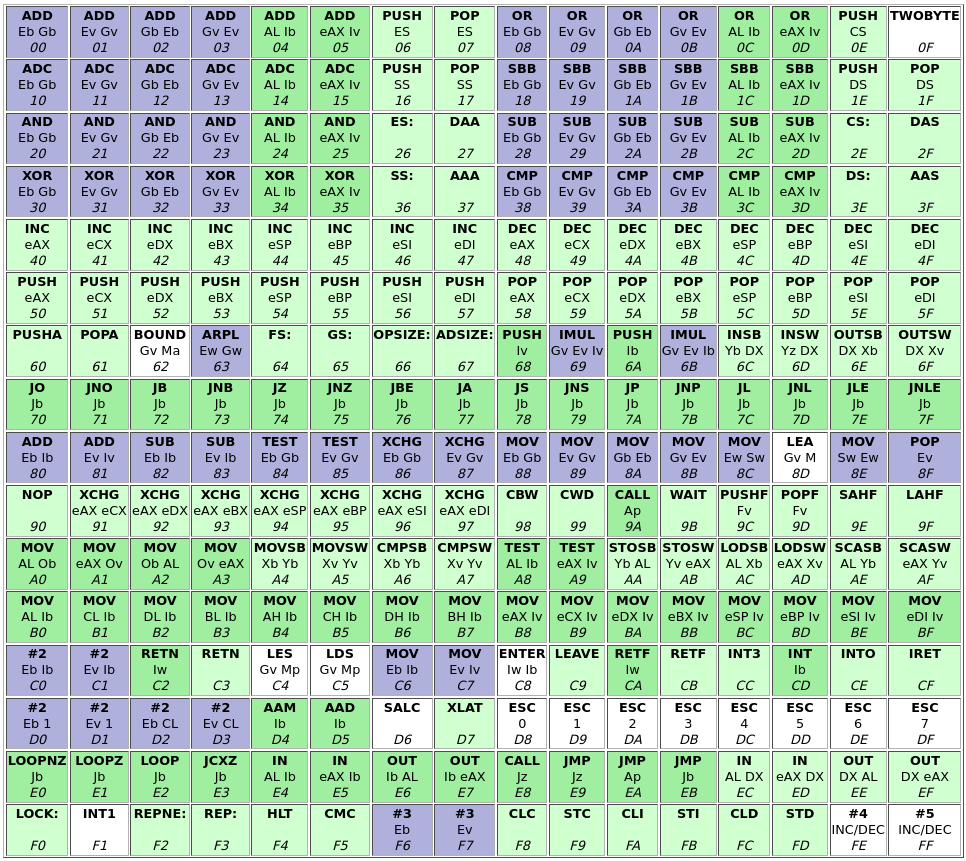

# dolos

Metamorphic engine written in Rust.

## Description

dolos is a [metamorphic engine](https://en.wikipedia.org/wiki/Metamorphic_code) written in Rust. It features obfuscation techniques including garbage code insertion and register usage exchange. It features inline x86 assembly using Rust's [asm!](https://doc.rust-lang.org/nightly/reference/inline-assembly.html) macro. Its implementation was inspired by this Stack Overflow [post](https://stackoverflow.com/questions/10113254/metamorphic-code-examples).

### Garbage Code Insertion

dolos inserts instances of the inline assembly below into its initial compiled binary. The NOP instructions are replaced with random junk instructions when the binary is executed. Subsequent executions replace this section of code with more garbage code. The structure of the payload allows the instances to be detected within the binary file even after the NOP instructions have been overwritten. The engine also performs checks before replacing the assembly to ensure that the metamorphosis will not corrupt the binary.

```rust
unsafe{
    asm!(
        ".code32",
        "push eax",
        "nop",
        "nop",
        "nop",
        "nop",
        "nop",
        "nop",
        "nop",
        "nop",
        "pop eax",
    );
}
```

### Register Usage Exchange

Register usage exchange replaces registers without changing the overall overall action of the code. dolos checks to ensure that the program will not be corrupted before exchanging the registers. The stack register (SP) is excluded because of this.

A simple example of a register change can be seen below.

```nasm
; Original
push eax
...
pop eax

; Updated
push ebx
...
pop ebx
```

PUSH and POP instructions were used by the metamorphic engine to perform register usage exchanges. The following [Intel x86 Assembler Instruction Set Opcode Table](http://sparksandflames.com/files/x86InstructionChart.html) shows that the PUSH and POP instructions are correlated as the respective registers for each have an constant offset of 8. For example, PUSH eax = 50 and POP eax = 58.



These registers can be exchanged by the metamorphic engine by keeping track of the register offset as seen in the table below.

| EAX | ECX | EDX | EBX | ESP | EBP | ESI | EDI |
|-----|-----|-----|-----|-----|-----|-----|-----|
|  0  |  1  |  2  |  3  |  4  |  5  |  6  |  7  |

## Usage

**Caution, dolos destructively overwrites the file provided as the argument.**

Ensure you have Rust and Cargo installed. Clone the repository and build the binary.

```sh
$ git clone https://github.com/mmore21/dolos.git
$ cd dolos/
$ cargo build
$ cd target/debug/
```

Examine the initial compiled binary.

```sh
$ md5sum dolos
0b44a144376f0c49398ab56a9b99f405  dolos

$ xxd dolos | less
...
0000c4a0: 660f b6c0 f6f1 66c1 e808 8844 2407 5090  f.....f....D$.P.
0000c4b0: 9090 9090 9090 9058 807c 2407 040f 93c0  .......X.|$.....
...
```

Run dolos and provide itself as the file to metamorphically change.

```sh
$ ./dolos dolos
```

Examining the binary again shows that it has been metamorphically changed. As seen in the hex dump, both garbage code insertion and register usage exchange occured.

```sh
$ md5sum dolos
9171078f1100986c25eb1c70f291d886  dolos

$ xxd dolos | less
...
0000c4a0: 660f b6c0 f6f1 66c1 e808 8844 2407 5321  f.....f....D$.S!
0000c4b0: c3bb 0090 7490 905b 807c 2407 040f 93c0  ....t..[.|$.....
...
```

## Disclaimer

This project is intended solely for educational purposes to better understand various metamorphic techniques. It is not to be distributed, modified, or used for any malicious intent. As stated in the license below, I take no responsibility for any malicious use of this metamorphic engine.

## License

dolos is available under the [GNU General Public License v3.0](https://choosealicense.com/licenses/gpl-3.0/).
